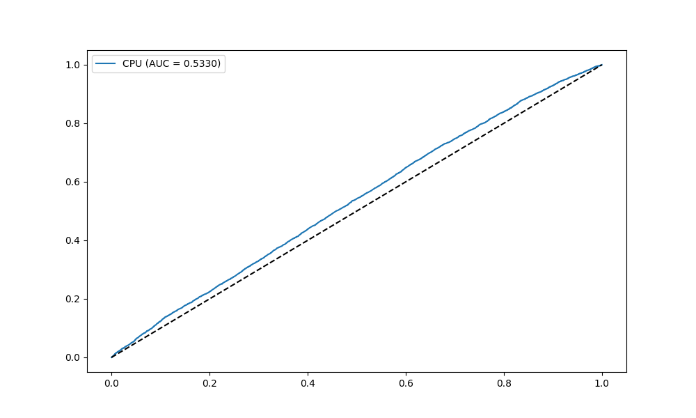
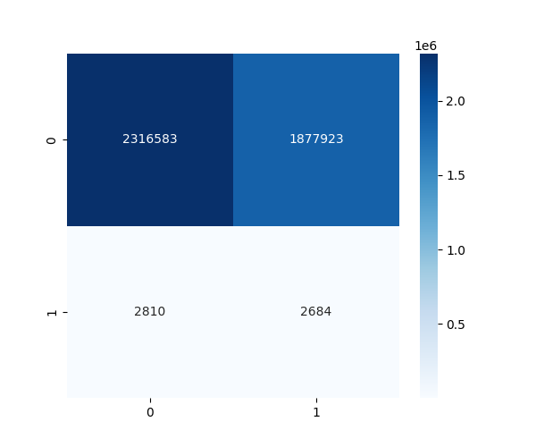

# Fraud Detection on Transaction Streams

A machine learning project designed to detect fraudulent transactions in financial data streams using **LightGBM**. This project handles a massive dataset of ~21 million records and addresses significant class imbalance challenges typical in fraud detection scenarios.

## 📊 Project Overview

- **Goal**: Identify fraudulent transactions in a large-scale financial dataset.
- **Dataset**: [Cifer-Fraud-Detection-Dataset-AF](https://huggingface.co/datasets/CiferAI/Cifer-Fraud-Detection-Dataset-AF) from HuggingFace.
- **Scale**: ~21,000,000 transactions.
- **Key Challenge**: Extreme class imbalance (~0.13% fraud cases).

## 🛠️ Technology Stack

- **Language**: Python 3.12
- **Model**: LightGBM (Gradient Boosting Framework)
- **Libraries**:
    - `datasets` (Hugging Face) for efficient data loading.
    - `pandas` & `numpy` for data manipulation.
    - `scikit-learn` for preprocessing and evaluation.
    - `matplotlib` & `seaborn` for visualization.

## 🚀 Features

- **Efficient Data Loading**: Handles multi-gigabyte datasets smoothly using Hugging Face's Arrow-based format.
- **Class Imbalance Handling**: Utilizes LightGBM's `class_weight='balanced'` and custom bagging strategies to address the scarcity of fraud labels.
- **Advanced Boosting**: Configured with **DART** (Dropout meet Multiple Additive Regression Trees) for better regularization.
- **Comprehensive Evaluation**: metrics including ROC-AUC, Precision, Recall, F1-Score, and Confusion Matrices.
- **Visualization**: Auto-generates ROC curves and training time comparisons.

## ⚙️ Installation & Usage

1.  **Clone the repository**:
    ```bash
    git clone https://github.com/your-username/Fraud_Detection_Light_GBM.git
    cd Fraud_Detection_Light_GBM
    ```

2.  **Set up a virtual environment**:
    ```bash
    python3 -m venv venv
    source venv/bin/activate
    ```

3.  **Install dependencies**:
    ```bash
    pip install -r requirements.txt
    ```

    *Note: For macOS users, you may need to install `libomp` if you encounter LightGBM errors:*
    ```bash
    brew install libomp
    ```

4.  **Run the detection script**:
    ```bash
    python fraud_detection.py
    ```

## 📈 Results & Analysis

The model was trained on a highly imbalanced dataset where legitimate transactions vastly outnumber fraudulent ones.

### Performance Metrics (Approximation)
- **Training Time (CPU)**: ~40 seconds (for 16.8M training rows).
- **ROC-AUC Score**: ~0.53
- **Recall (Fraud)**: ~49%
- **Precision (Fraud)**: Low (Due to aggressive balancing strategy).

### Visualizations

| ROC Curve | Confusion Matrix |
|or|or|
|  |  |

*(Note: The low precision indicates a high number of False Positives. In a real-world scenario, this would trigger many false alarms. Future work involves tuning the probability threshold and exploring SMOTE/ADASYN for better synthetic sampling.)*

## 🔮 Future Improvements

- **Feature Engineering**: Create aggregate features (e.g., avg transaction amount per user over time).
- **Resampling**: Implement SMOTE or Undersampling to handle imbalance more effectively than simple class weighting.
- **Hyperparameter Tuning**: Use Optuna to find the best LightGBM parameters for DART.
- **GPU Acceleration**: Compile LightGBM with CUDA/OpenCL support for faster experimentation.
