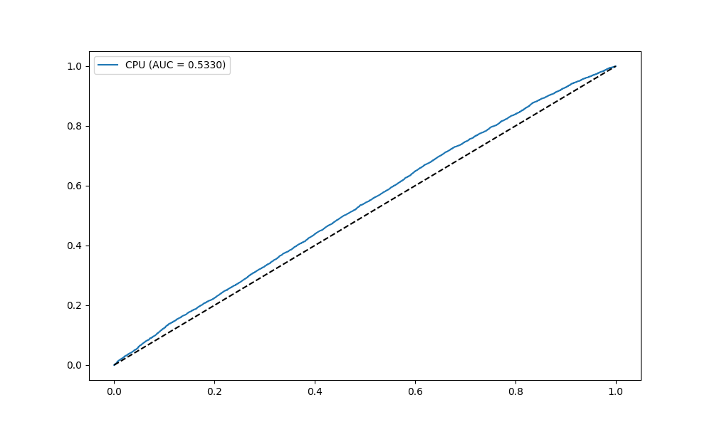
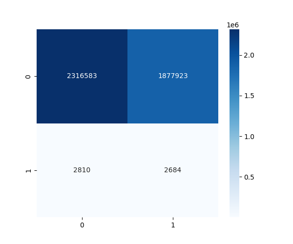

# Fraud Detection on Transaction Streams

A machine learning project designed to detect fraudulent transactions in financial data streams using **LightGBM**. This project handles a massive dataset of ~21 million records and addresses significant class imbalance challenges typical in fraud detection scenarios.

## Project Overview

- **Goal**: Identify fraudulent transactions in a large-scale financial dataset.
- **Dataset**: [Cifer-Fraud-Detection-Dataset-AF](https://huggingface.co/datasets/CiferAI/Cifer-Fraud-Detection-Dataset-AF) from HuggingFace.
- **Scale**: ~21,000,000 transactions.
- **Key Challenge**: Extreme class imbalance (~0.13% fraud cases).

---

## Technical Architecture

```
┌──────────────────────────────────────────────────────────────────┐
│                        DATA INGESTION                            │
│                                                                  │
│   HuggingFace Hub  ──►  datasets.load_dataset()  ──►  Arrow     │
│   (CiferAI/Cifer-Fraud-Detection-Dataset-AF)          format     │
│                                ▼                                 │
│                        df = ds.to_pandas()                       │
│                     (~21M rows, 11 columns)                      │
└────────────────────────────┬─────────────────────────────────────┘
                             │
                             ▼
┌──────────────────────────────────────────────────────────────────┐
│                      PREPROCESSING PIPELINE                      │
│                                                                  │
│  1. Drop irrelevant / PII columns                                │
│     └─ nameOrig, nameDest, isFlaggedFraud                        │
│                                                                  │
│  2. Encode categorical features                                  │
│     └─ LabelEncoder  ──►  `type` (CASH_IN, CASH_OUT, etc.)      │
│                                                                  │
│  3. Stratified Train / Test Split  (80% / 20%)                   │
│     └─ Preserves fraud ratio across both splits                  │
│        Train: ~16.8M rows  |  Test: ~4.2M rows                  │
└────────────────────────────┬─────────────────────────────────────┘
                             │
                             ▼
┌──────────────────────────────────────────────────────────────────┐
│                       MODEL TRAINING                             │
│                                                                  │
│   LightGBMClassifier                                             │
│   ├─ boosting_type : DART  (Dropout Additive Regression Trees)   │
│   ├─ objective     : binary cross-entropy                        │
│   ├─ metric        : AUC                                         │
│   ├─ n_estimators  : 100                                         │
│   ├─ num_leaves    : 31                                          │
│   ├─ learning_rate : 0.1                                         │
│   └─ class_weight  : balanced  (handles ~0.13% fraud minority)   │
│                                                                  │
│   Device: CPU  (~40s for 16.8M rows)                             │
└────────────────────────────┬─────────────────────────────────────┘
                             │
                             ▼
┌──────────────────────────────────────────────────────────────────┐
│                    EVALUATION & OUTPUT                           │
│                                                                  │
│   Metrics          │  Visualizations                             │
│   ────────────     │  ──────────────────                         │
│   ROC-AUC Score    │  roc_curve.png                              │
│   Precision        │  confusion_matrix_cpu.png                   │
│   Recall           │  training_time_comparison.png               │
│   F1-Score         │                                             │
│   Confusion Matrix │                                             │
└──────────────────────────────────────────────────────────────────┘
```

### Data Flow

| Stage | Input | Output |
|---|---|---|
| Ingestion | HuggingFace Hub (Arrow) | Pandas DataFrame ~21M rows |
| Preprocessing | Raw DataFrame | Encoded features, stratified splits |
| Training | X_train (16.8M), y_train | Fitted LGBMClassifier |
| Evaluation | X_test (4.2M), y_test | Metrics + PNG plots |

### Key Design Decisions

| Decision | Rationale |
|---|---|
| **DART boosting** | Dropout-based regularization reduces overfitting on imbalanced data |
| **`class_weight='balanced'`** | Automatically up-weights the minority fraud class without synthetic sampling |
| **Stratified split** | Preserves the 0.13% fraud ratio in both train and test sets |
| **Drop `isFlaggedFraud`** | Rule-based flag leaks ground truth, causing data leakage |
| **Arrow → Pandas** | HuggingFace Arrow format enables memory-efficient loading before conversion |

---

## Technology Stack

- **Language**: Python 3.12
- **Model**: LightGBM (Gradient Boosting Framework)
- **Libraries**:
    - `datasets` (Hugging Face) — efficient Arrow-based data loading
    - `pandas` & `numpy` — data manipulation
    - `scikit-learn` — preprocessing, splitting, and evaluation metrics
    - `matplotlib` & `seaborn` — visualization

---

## Installation & Usage

1. **Clone the repository**:
    ```bash
    git clone https://github.com/r1shabharora/Fraud_Detection_Light_GBM.git
    cd Fraud_Detection_Light_GBM
    ```

2. **Set up a virtual environment**:
    ```bash
    python3 -m venv venv
    source venv/bin/activate
    ```

3. **Install dependencies**:
    ```bash
    pip install -r requirements.txt
    ```

    *Note: macOS users may need `libomp` if LightGBM raises an OpenMP error:*
    ```bash
    brew install libomp
    ```

4. **Run the detection script**:
    ```bash
    python fraud_detection.py
    ```

---

## Results & Analysis

### Performance Metrics
| Metric | Value |
|---|---|
| Training Time (CPU) | ~40 seconds (16.8M rows) |
| ROC-AUC Score | ~0.53 |
| Recall (Fraud) | ~49% |
| Precision (Fraud) | Low — high false-positive rate due to aggressive balancing |

### Visualizations

| ROC Curve | Confusion Matrix |
|---|---|
|  |  |

> The low precision reflects a high false-positive rate — a known trade-off when prioritising recall on severely imbalanced data. Future work targets threshold tuning and synthetic oversampling to improve this balance.

---

## Future Improvements

- **Feature Engineering**: Aggregate features per user (e.g. rolling avg transaction amount, velocity checks).
- **Resampling**: SMOTE or ADASYN for better synthetic minority oversampling vs. simple class weighting.
- **Threshold Tuning**: Adjust decision threshold to balance precision/recall for the target deployment cost.
- **Hyperparameter Tuning**: Optuna-based search over DART-specific parameters (`drop_rate`, `skip_drop`).
- **GPU Acceleration**: Compile LightGBM with CUDA/OpenCL support for faster iteration.
